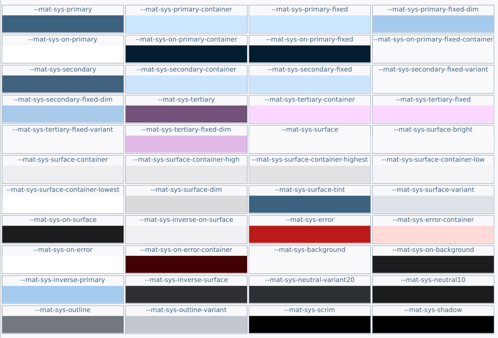
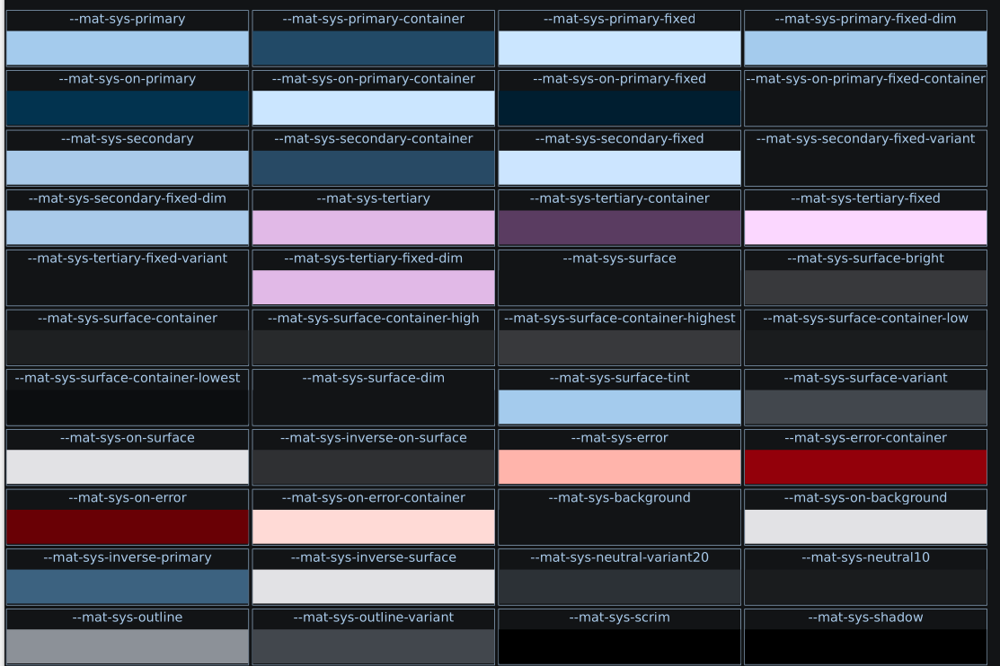

# Angular Theme Switcher
## Easy Theme Switcher for Angular-Material
A simple angular app with an atomic theme switcher component. The theme switcher adds/replaces a theme class and light/dark class in the \<body\> tag of the app. The theme class contains all the css color variables, typography values, and the material-icons fonts.

the theme switcher component is mostly self contained. Custom themes are located in the 'themes' subfolder and each theme is listed in custom-themes.scss as:

    ```
    :root {
      .blueGreyTheme {
        @include mat.theme((
          color: (
          primary: blue-grey-theme.$primary-palette,
          tertiary: blue-grey-theme.$tertiary-palette
          ),
          typography: Roboto,
          density: -1
        ));
      }
        //-- more themes...
              .
              .
              .
    }
    ```

You must include this in the root stylesheet 'styles.scss':

```
    @use '@angular/material' as mat;
    @use './app/theme-switcher/custom-themes.scss';
```

You now have all the themes as well as all the theme color variables:

```
    var(--mat-sys-primary)
    var(--mat-sys-primary-container)
    var(--mat-sys-primary-fixed)
    var(--mat-sys-primary-fixed-dim)
    var(--mat-sys-on-primary)
    var(--mat-sys-on-primary-container)
    var(--mat-sys-on-primary-fixed)
    var(--mat-sys-on-primary-fixed-container)

    var(--mat-sys-secondary)
    var(--mat-sys-secondary-container)
    var(--mat-sys-secondary-fixed)
    var(--mat-sys-secondary-fixed-variant)
    var(--mat-sys-secondary-fixed-dim)

    var(--mat-sys-tertiary)
    var(--mat-sys-tertiary-container)
    var(--mat-sys-tertiary-fixed)
    var(--mat-sys-tertiary-fixed-variant)
    var(--mat-sys-tertiary-fixed-dim)

    var(--mat-sys-surface)
    var(--mat-sys-surface-bright)
    var(--mat-sys-surface-container)
    var(--mat-sys-surface-container-high)
    var(--mat-sys-surface-container-highest)
    var(--mat-sys-surface-container-low)
    var(--mat-sys-surface-container-lowest)
    var(--mat-sys-surface-dim)
    var(--mat-sys-surface-tint)
    var(--mat-sys-surface-variant)
    var(--mat-sys-on-surface)

    var(--mat-sys-error)
    var(--mat-sys-error-container)
    var(--mat-sys-on-error)
    var(--mat-sys-on-error-container)

    var(--mat-sys-background)
    var(--mat-sys-on-background)

    var(--mat-sys-inverse-on-surface)
    var(--mat-sys-inverse-primary)
    var(--mat-sys-inverse-surface)

    var(--mat-sys-neutral-variant20)
    var(--mat-sys-neutral10)

    var(--mat-sys-outline)
    var(--mat-sys-outline-variant)

    var(--mat-sys-scrim)
    var(--mat-sys-shadow)
```

to create a custom color scheme based on Google's Material Design spec you can use Angular Material's built-in generator:
```
    ng generate @angular/material:m3-theme
```
You must supply a hex 'primary' color and optionally hex colors for 'secondary', 'tertiary', and 'neutral' palettes. This yields a 'custom-theme.scss' file.

below are both the light and dark color swatches for the custom 'blueGreyTheme':








Enjoy. You can view this app at https://hawkrdg.com/sandbox4